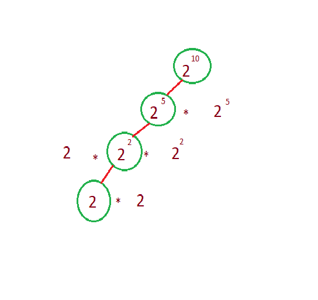

# Efficiantly calculating power
The power (or exponent) of a number says how many times to use the number in a multiplication.  
baseexponent  
The Brute Force solution to calculate power is to multiply base exponent times by itself. 
The code Looks like this

    for i in range(exponent):
		pow = pow * base

This takes a time complexity of O(n).  
We can achieve a time complexity of O(log n) if we use divide and conquer algorithm.

    

 
From above image let's consider 210. we can calculate 25 and multiply by itself. We repeat till exponent reaches 0.If exponent reaches 0 then we return 1.      
  
<b>Program<b>  

    def calculate_power(base , exponent):
        if exponent == 0:
            return 1
        temp_power = calculate_power(base ,int(exponent/2))
        if (exponent % 2) == 0:
            return temp_power * temp_power
        else:
            return base * temp_power * temp_power

    # test code
    base = 3
    exponent = 3
    print(calculate_power(base,exponent))
    exponent = 4
    base = 33
    print(calculate_power(base,exponent))

The output for the following is  
 

    

 
