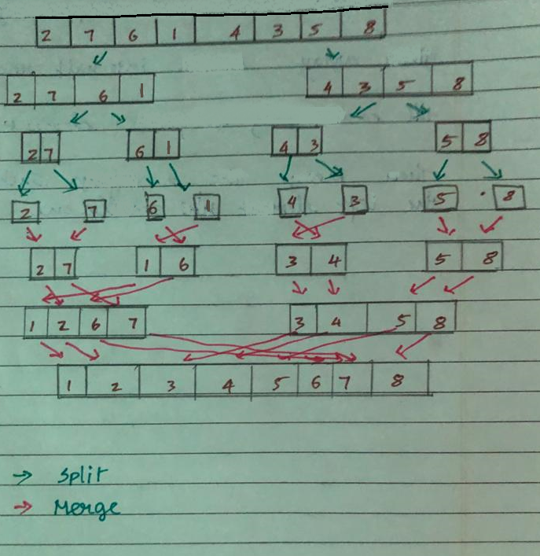

# Merge Sort 

Merge Sort is a sorting algorithm which uses divide and conquer algorithm.
The key idea in this method is we split the array into halves  and sort the halves  which makes the sorting of entire array faster

Let's consider an example here with an array of 8 elements.
 

    
    <!--  -->

Initially we split the array into two parts with elements [2, 7, 6, 1] on one side and [4, 3, 5, 8] on the other side.
We keep on splitting it till we get one element and arrange them as we merge them.

## Time Complexity

| Worst Case        | Average           | Best Case  |
| ------------- |:-------------:| -----:|
| O(NLogN)      | O(NLogN) | O(NLogN)|

Time complexity of Merge Sort is  θ(NLogN) in all 3 cases, as merge sort always divides the array into two halves and take linear time to merge two halves.

## Space Complexity

O(N)

## Links 

[Divide and Conquer - by Khan Academy](https://www.khanacademy.org/computing/computer-science/algorithms/merge-sort/a/divide-and-conquer-algorithms)

